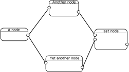

# Data-driven execution flow

[Back to the table of contents](README.md)

Before we jump into how to implement branching into Nodezator, it is useful to consider how execution happens in Nodezator.

Nodezator structures its node layouts as a [graph](https%3A%2F%2Fen.wikipedia.org%2Fwiki%2FGraph_%28discrete_mathematics%29), more specifically as a [DAG](https://en.wikipedia.org/wiki/Directed_acyclic_graph)(a directed acyclic graph). In other words, the node layout is strucutured using vertices and directed edges. Each vertice is a call, and the sockets represent the gates through which the data flows into and out of the vertices. Incomming data that go in the call as arguments and outgoing data leave the call as the return value.

Each edge is a connection between the output sockets of a node and the input sockets of the next one, represented by a line. The edges have a clear direction (from output to input sockets). The graph is acyclic, that is, the flow doesn't form cycles. This means a vertice is never executed more than once. In other words, the edges never lead the data into a node already executed. Even though the arrow heads in the figure above aren't used in the software, they are implied due to the relationship between the different sockets in the nodes. We know that data comes from output sockets (the ones on the right side of nodes) into input sockets (the ones on the left side of the nodes), so the arrows are not needed.

So, how does execution happen? Execution in nodezator DAGs is data-driven. It means that as soon as all needed data arrive in a node, the node executes. Whenever the node layout is executed, each node is visited, we check whether it has all data needed to execute or whether it is waiting for data from another node. If the node has all data needed, it is executed, and its output sent to the next nodes, otherwise we just skip it until we visit it again and it has all data needed. This goes on until all and each node is executed. This way, each and all of the connections in the entire node layout are used to forward data, sooner or later, when the node executes.

That is to say that each node is executed as soon as it has all data needed to execute. So a node will be executed regardless of its position in the 2D space. No matter if it is the first one from left to right or the last one, or whether it is in a higher spot.

Think of our graph/DAG as a factory with many machines connected by conveyor belts. Each machine receives materials from incomming conveyor belts, processes them and inserts the processed material into the outcomming conveyor belts.

| Analogy element | Equivalent in nodezator |
| --------------- | ---------- |
| Factory | node layout |
| Machines | nodes |
| Conveyor belts | connections linking nodes together |
| Materials | data travelling between nodes |

Additionally, even though all elements have their own purpose and importance, the availability of materials is what drives the operation of the machines and, as a consequence, of the entire factory.
