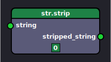

# Approach to implement looping in Nodezator

[Back to table of contents](README.md)

If one is aware of how versatile iterating/looping over data is in Python, one could say that a looping feature, that is, the representation of for-loops and while-loops in Nodezator, is not strictly needed in Nodezator. This is so because Python programming allows multiple paradigms and one of such paradigms is functional programming, which is specially compatible with Nodezator, requiring very few changes in Nodezator in order to tap in the full potential of iteration.

Because of that I was actually convinced of not implementing looping in Nodezator as found in other node editors. Such looping from other node editors consists of being able to pass items from a collection through a set of nodes individually, instead of just passing the whole collection at once.

However, this functional approach I wanted to pursue may still be confusing/intimidating to some users due to the higher popularity of for-loops. And to be honest, for-loops are simple and fine enough on their own, and known by most, which is a big plus.

Because of that, rather than pursuing only the functional approach, I decided to actually come up with new kinds of nodes meant to emulate for-loops as the main tool for looping in Nodezator. And also implement the functional approach as an alternative and complement to it.

Also, for the sake of simplicity, let's pretend we introduced new default (app-defined) nodes in Nodezator representing string methods. This is actually something we intend to do in the near future. One of such nodes, for instance, would be the str.strip() node. Here's a first representation (the final form will probably have an string entry widget attached to it):



Without further ado, I'll present the nodes emulating a for-loop and after that I'll present the functional approach for those that might be interested.


## Nodes emulating a for-loop

To emulate a for-loop, I plan to introduce 02 new nodes. The first one can be used by itself. It is called a `for_loop` node. The second one can only be used in conjunction with the first one and is called the `item_catching` node. Here's a representation of the nodes:


### Emulating a "regular" for-loop

When used by itself, the first node represents a regular for-loop in Python. In other words, you pick one item from the given iterable at a time and pass it through each connected node. Here's an example:


In the example above, we convert and save a list of JSON files (`file_a.json`, `file_b.json`, ...) as YAML files. The list of file names (in the `list_from_args` node) is passed to a `for_loop` node. Since this node emulates a for-loop, the nodes following it form the body of a for-loop. The `for_loop` node thus passes each item through the following nodes one at a time, causing each item to have their JSON content loaded, converted into YAML and saved using the same file name, but with the suffix changed from `.json` to `.yaml`.


### Emulating a for-loop used in a comprehension/generator expression

When used in conjunction, the `for_loop` and `item_catching` node work as a for-loop inside a comprehension on generator-expression. As before, the first node takes an iterable and sends each item one by one to the nodes connected to it. Once the iteration finishes, the `item_catching` node returns an iterator containing all the items that reached it. Here's an example:


In the image, the body of the comprehension/generator expression is clearly defined by the nodes between the `for_loop` and `item_catching` nodes. That is, in this loop, each item of the list given at the beginning is passed to a str.strip and then to str.title. The resulting iterator contain the all the individual items that reached the `item_catching` node, so we catch all those items within a new list object. And thus, we have a complete example demonstrating how we took the items of a list and used them to generate a new list by processing the items of the first one.

Note that the `item` output of the `for_loop` node and the `item` input of the `item_catching` node are represented by half-circles. This is just to represent that the nodes complement each other, that items comming from the `for_loop` node are expected to reach the `item_catching` node and that the data that travels between them is fragmented into individual items that travel one at a time.


### Using the nodes to filter

In this other example, we extend the node layout from the previous example to also filter out items according to a given criteria. To do this, we just need to ensure only the items that meet our criteria reach the `item_catching` node. For this, we can use a `if_elif_else` node presented in an early section.


## Functional approach to looping/iterating over data

However, this is not to say that in its current state Nodezator isn't capable of tapping into the full potential of iterating/looping over data. Let's revisit some concepts and tools regarding iteration in Python and, as we review some concepts and tools I'll present the functional approach to achieve such results.

In summary, rather than needing for-loops to iterate over each item in a collection, Python also provides built-in functions that do that for you, as well as several standard library functions as well. If this is not enough, you can even define generator-functions using the `yield` or `yield from` statements. Now, for-loops are fine, it is just that Python allows as much power and flexibility without using them (even though, as I said before for-loops are fine). There's also an advantage of using the functional approach, which I'll also present.


### The map() built-in function

[subsection is a work in progress]

The map() built-in function takes a callable (for instance, a function) and one or more iterables (for instance, a collection) and applies the function to each item or group of items, returning an iterator containing the result of each call. For instance, if you have a list of strings and you want to make sure there's no whitespace at the beginning and ending of the strings, you can just...

```python
### ...do this
new_list = list(map(str.strip, list_of_strings))

### ...instead of this
new_list =  [
    item.strip()
    for item in list_of_strings
]
```

Note that, since map() returns an iterator, you need to wrap the call into a call to list(), so the items are stored in a list.

In Nodezator, this can be done like this...


However, there are 02 things in the nodezator graph above about which I'm not happy: first, accessing string methods is too convoluted (it took 03 nodes to access str.strip(), as shown in the image). Nonetheless, this problem is temporary, since I intend to make string methods available by default in Nodezator, each with its own node, since they are very useful.

The second and more deep problem, is that even if we had a `str.strip()` node, we would still not be able to reference the str.strip callable directly. As we know, nodes represent calls, not the callables themselves. Which means we cannot reference the callables directly in the graph. This is probably the biggest problem regarding the usage of iteration in Nodezator because what is the point of being able to use map() to apply functions over items in a collection if we can't access our node callables directly and thus would have to write custom functions anyway?

The answer is simple: there should be a way to access the callables of the nodes directly in Nodezator. After all, this is actually super simple, no? In plain Python code, the only thing differentiating a function call from the function itself is the usage of parentheses besides the callable. That's what people mean when they say functions are first-class citizens in Python. Functions are just objects that we can call. In Python, callables are just another kind of object, a kind of data describing a behavior.

So here's my proposed solution: to be able to reference the callable from a node directly in the graph. In practice, with the single click of a button we should be able to change a node in the graph so that rather than represent the call, it would represent the callable itself, and could thus itself be fed into other nodes. In other words, the same way we plan to be able to mute nodes by pressing "m" in the future, by pressing a single button we'd change the node to this special form.

Let's see this in action.

As we know, the `str.strip()` node is already useful as it is. You can just pass a string to it and have a stripped version of it come out as its output. However, as Nodezator is right now, we cannot directly use the `str.strip` callable in conjunction with the map() node. The only thing we can do with it right now is just perform the single call which this node represents and obtain the output.

As we proposed, we want to be able to press a single button and have the node switch into a mode that allows us to reference its callable. For now, let's use the 'c' key. Effectively, we'd be making it so the node represents data (the callable itself), rather than a call. So, by pressing the "c" key (for "callable reference", or "citizen", from "first-class citizen" nomenclature), the node switches to the new mode and changes shape to indicate it. It now has a single output socket that allows us to pass on a reference to the callable:


And so we can use it in conjuntion with the map() node seamlessly:


You'll be able to do this with any callable node you want, be it app-defined or the ones you define yourself. This means your nodes will be even more versatile. You'll be able to write nodes that focus in processing a single piece of data only. Then, when/if you need to process several items, you just have to convert it to "callable reference"/citizen mode and pass the reference to the map() node, along with your collection of items. Using this mechanism you'll be able to perform all kinds of complex stuff, like chaining functions using map() to treat multiple items at once:


So, with this problem out of the way with the help of this new support feature proposed, we can tap into the full potential of iterating/looping over data in Nodezator using the functional approach. Let's keep exploring more use-cases.


### The built-in filter() function and more

[subsection is a work in progress]

Within the body of a for-loop, we may not just apply a function to each item in our collection. We sometimes want to filter out the items, keeping only those that meet certain criteria. For this, we have functions like the built-in filter(), which takes a function or None as the first argument and an iterable as the second argument, and returns an iterator containing only the items for which applying function(item) evaluates to a truthy value. If the first argument is `None`, instead, all truthy items are kept.


If we need, there's also a standard library function opposite to filter(), which is itertools.filterfalse(), which keeps only items which evaluate to falsy values.


itertools.dropwhile() and itertools.takewhile() can also be used to filter items. The former ignores items while they evaluate to truthy values with the given function, until one of them evaluates to a falsy value, at which point such item and all subsequent ones are kept. The latter, as the name implies, does the opposite, keeping successive items that evaluate to truthy values until an item evaluates to a falsy value, at which point the item is dropped along with all remaining ones.


### Using custom generator-functions

[subsection still to be written]

### Advantages of chaining functions that return iterators

[subsection still to be written]

---

<!-- Other loose excerpts about stuff to discuss here (you can ignore this for now):

"Having the flow cycle through the same node is also incompatible with the [DAG structure](https://en.wikipedia.org/wiki/Directed_acyclic_graph) used by Nodezator."

"I came to the conclusion that due to Nodezator's directed acyclic graph execution approach..."
-->

