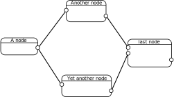
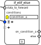
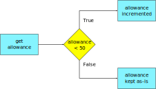
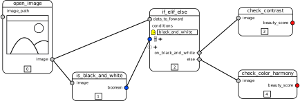
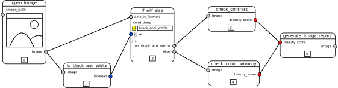
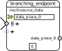
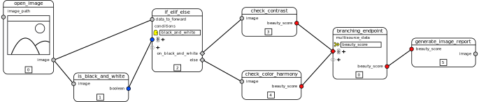

# Branching and looping in Nodezator

I spent the last week (from September 25th to 30th) researching the usage of branching and looping in other apps. I wanted to make sure I didn't miss anything important when implementing such features in Nodezator. In this text I present the conclusions I achieved and the approach I intend to follow to implement branching in Nodezator. I also explain why looping can already be performed in Nodezator and thus doesn't need to be implemented.

First of all, the research wasn't anything deep nor time-consuming. That would require more time and experimentation. In an ideal world, I'd like to go through all or at least some of the software listed [here](https://github.com/ivanreese/visual-programming-codex/blob/main/implementations.md), trying and analyzing them. Instead, I focused in looking for the usage of those features in some select apps, trying to grasp the underlying principles behind such usage. I read some online documentation and watched some videos demonstrating the features in action.

I mostly looked into the [Blueprint Visual Scripting system](https://docs.unrealengine.com/5.0/en-US/blueprints-visual-scripting-in-unreal-engine/). This was not due to personal preference nor familiarity. I actually had never used it. However, in concept it is the closest app to Nodezator in existence that I know of. That is, it is a system whose visual components aim to help organize components from an existing language visually. The difference is that Blueprints uses C++ while Nodezator uses Python.

I also looked into other apps, mostly those already mentioned by some Nodezator users like Ryven, StremeCoder and even apps not directly related to node editing like some CAD software.

Before this research I already had a complete design in mind for the implementation of branching (if/elif/else/match/case statements) in Nodezator. The research didn't change my mind at all regarding such design, which means we were already in a good direction. The research was important regardless, since it helped ensure I wasn't missing anything important. Regarding looping (for/while statements), I came to the conclusion that the idea of a looping feature for Nodezator isn't needed at all.


## Data-driven execution flow

Before we jump into how to implement branching into Nodezator, it is useful to consider how execution happens in Nodezator.

Nodezator structures its node layouts as a [graph](https%3A%2F%2Fen.wikipedia.org%2Fwiki%2FGraph_%28discrete_mathematics%29), more specifically as a [DAG](https://en.wikipedia.org/wiki/Directed_acyclic_graph)(a directed acyclic graph). In other words, the node layout is strucutured using vertices and directed edges. Each vertice is a call, and the sockets represent the gates through which the data flows into and out of the vertices. Incomming data that go in the call as arguments and outgoing data leave the call as the return value.


Each edge is a connection between the output sockets of a node and the input sockets of the next one, represented by a line. The edges have a clear direction (from output to input sockets). The graph is acyclic, that is, the flow doesn't form cycles. This means a vertice is never executed more than once. In other words, the edges never lead the data into a node already executed. Even though the arrow heads in the figure above aren't used in the software, they are implied due to the relationship between the different sockets in the nodes. We know that data comes from output sockets (the ones on the right side of nodes) into input sockets (the ones on the left side of the nodes), so the arrows are not needed.



So, how does execution happen? Execution in nodezator DAGs is data-driven. It means that as soon as all needed data arrive in a node, the node executes. Whenever the node layout is executed, each node is visited, we check whether it has all data needed to execute or whether it is waiting for data from another node. If the node has all data needed, it is executed, and its output sent to the next nodes, otherwise we just skip it until we visit it again and it has all data needed. This goes on until all and each node is executed. This way, each and all of the connections in the entire node layout are used to forward data, sooner or later, when the node executes.

That is to say that each node is executed as soon as it has all data needed to execute. So a node will be executed regardless of its position in the 2D space. No matter if it is the first one from left to right or the last one, or whether it is in a higher spot.

Think of our graph/DAG as a factory with many machines connected by conveyor belts. Each machine receives materials from incomming conveyor belts, processes them and inserts the processed material into the outcomming conveyor belts.

| Analogy element | Equivalent in nodezator |
| --------------- | ---------- |
| Factory | node layout |
| Machines | nodes |
| Conveyor belts | connections linking nodes together |
| Materials | data travelling between nodes |

Additionally, even though all elements have their own purpose and importance, the availability of materials is what drives the operation of the machines and, as a consequence, of the entire factory.


## Approach to implement branching in Nodezator

As we just explained, all conveyor belts in our factory are travelled sooner or later by the materials when the node layout executes. Let's think of each conveyor belt as a path through which the materials (data) travel. It means no path in particular is chosen over another, all paths are treated equal. Data doesn't pick a specific path, it travels all of them.

Hence, including branching in Nodezator means making our node layouts even more flexible by creating the possibility to, when specified by the user, allow the execution flow to follow a particular path instead of others, depending on specific condition(s) also defined by the user.

Since data flowing (the travelling materials in our analogy) is what causes the nodes to execute, enabling branching in nodezator is a matter of, upon reaching a specific node in the graph, only allow the data to flow through a chosen path and ignore others. In other words, we need a special node in a nodezator graph that intercepts data and only lets it proceed through a single path among multiple ones.

Using our factory analogy, we'd say we need a machine that only sends the materials through a specific conveyor belt and ignore others. Since a machine only executes when the materials arrive on it, by not sending materials through a particular path we make it so those machines never execute. We can thus selectively execute portions of our graph, effectively enabling the branching feature in Nodezator.

Let's pick a name for this special node/machine, for future reference. In order to be 100% clear or close, I believe it is best to call the node an `if_elif_else` node. It just leaves no doubt as to what it does.



It has diamond-shaped output sockets, to convey that only one of the sockets will be chosen to forward the received data. This diamond shape is used in flowcharts to identify different branches depending on specific conditions, so I think the shape is appropriate here.

Note that there's a hollow socket just below the first condition. It means you can provide any number of scenarios you want. Whenever you plug new data in this hollow socket a new input socket for the new condition is created along with an entry widget where you can give a name to that condition. A corresponding diamond-shaped output socket is also created from where the data is forwarded when the corresponding condition evaluates to True. A door icon is also drawn besides the entry widget for each condition, so that is easier to spot the different existing conditions.

Whenever you edit the condition's name, the name of the output near the diamond-shaped output socket is also changed accordingly. Here, because our condition is named `condition_a`, the corresponding ouput is named `on_condition_a`. When this `if_elif_else` node is executed, because it will forward the data through only one of its output sockets, only that path will be executed and the nodes linked to the other output socket will be ignored. Actually, the node will also mark the nodes connected to the ignored paths so they are ignored.

A fixed `else` output exists at the end so the data is forward through it if none of the existing conditions evaluates to `True`.

Also note that though the `if_elif_else` node only has one socket for the data be forwarded, it doesn't mean you can only use one piece of data from the graph at a time on the different paths. This piece of data just serves to signal which path is to be followed and the remaining ones to ignore. You can still use more data from the graph without needing to pass it through an `if_elif_else` node. Remember, execution in Nodezator is data-driven, so you just need to deprive a path of a single piece of data to prevent it from executing.


## Branching in Python code

Now we need to discuss how this implementation translates into plain Python, since our node layouts must be exportable as Python in order to keep our Python exporting feature functional.

In plain Python, the different paths are represented by indented code blocks, from which one is picked and executed, based on specific condition(s). if/elif/else-blocks may be the most straighforward example. For instance, the code below takes an image and generates a "beauty score". However, how such beauty score is defined depends on whether the image is black and white or has colors. If it is black and white, the beauty is defined by its contrast. If it has colors, the beauty is defined by the color harmony.

```python
image = open_image('image.png')

if is_black_and_white(image):
    beauty_score = check_contrast(image)

else:
    beauty_score = check_color_harmony(image)
```

[Structural pattern matching](https://docs.python.org/3/whatsnew/3.10.html#pep-634-structural-pattern-matching), available since Python 3.10 via the match/case statements, serves the same purpose through a declarative approach that allows more expressiveness when picking specific paths of execution according to the kind of data being treated. Only the approach is different from that of if/elif/else blocks. The purpose, however, remains the same: **to present distinct paths from which to pick one depending on a specific condition**.

```python
data = load_json('file.json')

match data:

    case {'purchase_records': records}:
        result = process_records(records)

    case {'earnings_report': earnings}:
        result = process_earnings(earnings)
```

Another thing that remains the same in branching, regardless of the usage of if/elif/else or match/case blocks, is the fact that **there's always a minimum of two paths from which to pick**. That is, even when a sole if-block is used, the fact that the condition can evaluate to false and the block may not be entered can also be conceived as a different path of execution. For instance, observe the code below:

```python
allowance = get_current_allowance()

if allowance < 50:
    allowance += 50 - allowance
```

Even though there's only a single if-block, the allowance now has **02 different possible "histories"** of which only one will happen. One in which the allowance is too low (less than 50) and is thus incremented to reach 50 (the if-block executes) and another where this wasn't needed and the allowance keeps its original value. That is, it is a though even lone if-blocks have a tacit `else: pass` clause.




## Putting it all together

So, we already have the `if_elif_else` node described earlier and we just reviewed a bit of conditional blocks in plain Python and know that whenever a conditional block is entered the code is indented. I think, at this point, we have enough info for a first draft of the branching feature. That is, whenever the data flows into a `if_elif_else` node...

- ...for the execution in the app, the data is only forwarded to the nodes connected to the branch for which the condition evaluates to True, meaning the other branches won't execute;
- ...for the Python exporting feature, each branch is exported as it's own indented conditional if/elif/else block;

As a demonstration, here's how we'd represent the previous "beauty score" example within Nodezator:



And here's the corresponding code (with the variable names changed to ommit the id numbers, for the sake of readability), as Nodezator would export it:

```python
image = open_image()

boolean = is_black_and_white(image)

data_to_forward = image
condition_a = boolean

if condition_a:
    beauty_score = check_contrast(data_to_forward)

else:
    beauty_score = check_color_harmony(data_to_forward)
```

Of course there's a lot of other implementation details that could be discussed, but I wanted to focus this analysis in the main points lest we end up with a massive text.


## Further problems and the corresponding solution

Well, this doesn't solve all use-cases related to branching. Picking a branch of execution and completely shutting down another is not enough, because the branches sometimes produces data that is used back in the original branch. For instance, consider the code below, which is the extension of an example we visited previously in this text:

```python
image = open_image('image.png')

if is_black_and_white(image):
    beauty_score = check_contrast(image)

else:
    beauty_score = check_color_harmony(image)

image_report = generate_image_report(beauty_score)
```

In the last line, once one of the conditional blocks is executed, the `beauty_score` data is used to generate a report in the form of an image. Here's more or less how it would be represented in nodezator using the `if_elif_else` node considering what we learned until now:



There are several problems with this representation. First, the input socket `beauty_score` in the `generate_image_report` node has more than one data linked to it. This isn't possible because output sockets can only have one source of data. Second, since the `if_elif_esle` node also marks nodes connected to ignored paths so they are also ignored, and the `generate_image_report` is now connected to both paths through the `check_contrast` and `check_color_harmony` nodes, the `generate_image_report` node would be ignored as well. Finally, since the `generate_image_report` node is now connected to both paths, how would we export it as Python code? Would we copy the call in both `if` and `else` blocks, or would we indent it?

My proposed solution to all of those problems is to introduce another new node as a counterpart of the `if_elif_else` node. Such node will have special input sockets, also diamond-shaped, that can be linked to multiple outputs at the same time. Let's call it `branching_endpoint`, since it represents the point at which each different conditional blocks ends in a Python script and the code returns to the indentation level before entering one of the conditional blocks.



As mentioned before, the diamond shape is used in flowcharts to identify different branches so here it also has a similar meaning, except that the different branches are being joined, rather than being chosen. Note that you can created multiple input sockets, each being able to receive a piece of data from multiple sources. Each of those pieces of data can receive a custom name within an entry created just for it. Each piece of data listed automatically creates a new output socket from where that piece of data is forwarded. The name of the output socket is the one provided in the entry for the input socket and can be edited at your will.

When the node is executed, the input sockets just need to forward the data received through one of the multiple sources linked to them. Also, since the node receives data from multiple paths, it means it is also connected to them, even the ones which are marked to be ignored. However, this special node also signals nodezator to stop ignoring nodes once it is reached.

Looking back at the code from the extended `beauty_score` example presented before, we can know represent it properly in Nodezator:




## Wrapping up implementation of branching feature

In summary, the branching feature in Nodezator will be supported by 02 new nodes which can handle all related use-cases together. A part of the use-cases requires only the usage of the `if_elif_else` node, that is, whenever the execution ends in one of the paths presented. The other part of the use-cases requires the usage of the `branching_endpoint` node along with the `if_elif_else` node, and consist of the circumstances where the paths of execution presented need to join at some point. The usage of a `branching_endpoint` node without the corresponding `if_elif_else` node doesn't make sense and will probably result in a warning being presented to the user via the user log (that can be accessed via **<Ctrl+Shift+J>** in the app).


## About `match/case` statements

[write section]


## Why a looping feature isn't needed

[this sections is still only a draft]

Regarding for-loops, Nodezator is already flexible and versatile enough to handle all the use-cases I could find or think of. Most use-cases I could find handled looping the same way: by passing each item from an iterable, one at a time, through a series of nodes until all the items were visited. Then, the flow resumed by following another predefined path triggered by the end of the iteration. However, this can be easily reproduced in Nodezator with help from the built-in node that uses the map() function, where we can specify a callable to go through all of the items inside an iterable. Python already provides an innumerable ever-increasing collection of callabes that process. Moreover iteration in Python can be customised in any level desirable using iterator functions with `yield` and `yield from` statements.

For while-loops the situation is even


Having the flow cycle through the same node is also incompatible with the [DAG structure](https://en.wikipedia.org/wiki/Directed_acyclic_graph) used by Nodezator.

I came to the conclusion that due to Nodezator's directed acyclic graph execution approach,
